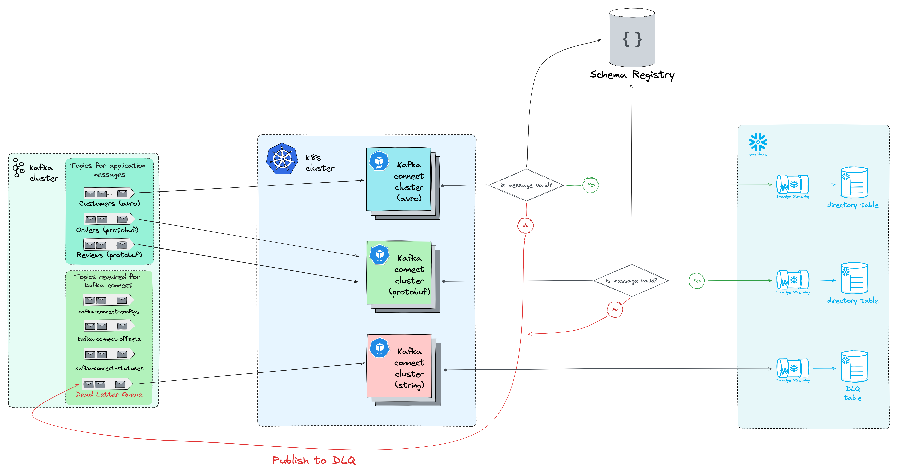

## Consuming and Storing Kafka Messages in Snowflake Using Kafka Connect 

Go app used in part 2 of the blog [Consuming and Storing Kafka Messages in Snowflake Using Kafka Connect](https://medium.com/atlantbh/consuming-and-storing-kafka-messages-in-snowflake-using-kafka-connect-part-2-580fdb25bdb6).   
The purpose of the app is to read json files with sample messages from the `data/` directory, serialize them with both **Protobuf** and **Avro** serialization formats using the schemas from [Confluent Schema Registry](https://docs.confluent.io/platform/6.1/schema-registry/index.html) and publish them to Kafka hosted in Kubernetes using [Koperator](https://github.com/banzaicloud/koperator).

